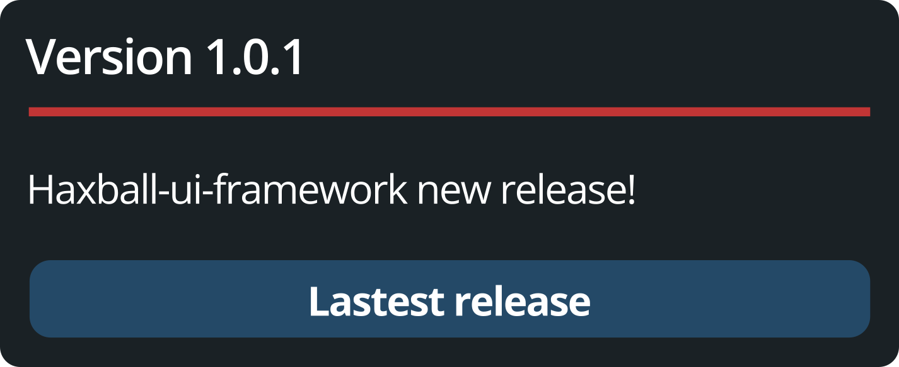

<p align="center">
  
</p>

# haxball-ui-framework

<p align="center">
  <a href="README.md">🇺🇸 English</a> | 🇪🇸 Español
</p>

<p align="center">
<a href="https://www.npmjs.com/package/haxball-ui-framework">
  
</a>
<a href="LICENSE">
  
</a>
<a href="#arquitectura">
  
</a>
<a href="#estructura-del-proyecto">
  
</a>
<a href="#hoja-de-ruta">
  
</a>
</p>

**HaxBall UI Framework es una capa UI mínima y estable para construir ventanas overlay sobre el cliente de HaxBall.**

No es un framework completo tipo React. No es un engine de juego.
Es un **núcleo UI pequeño y bien diseñado** que te da control total del DOM sin pelear con HaxBall.

---

## 📦 Instalación

```bash
npm install haxball-ui-framework
```

```js
// ES Module (Vite, Webpack, Rollup)
import HaxUI from 'haxball-ui-framework';

// CommonJS (Node.js)
const HaxUI = require('haxball-ui-framework');
```

O inyecta el bundle IIFE directamente en HaxBall (sin npm):
```js
// Pega dist/haxball-ui-framework.iife.js en la consola de DevTools
// o cárgalo con @require en un userscript de Tampermonkey
HaxUI.diagnostics(); // → { initialized: false, version: 'v1', ... }
```

---

## 🧠 Idea Central

HaxBall UI Framework introduce una **capa de overlay liviana** sobre el DOM de HaxBall que permite:

- crear y gestionar ventanas
- actualizar contenido dinámicamente
- destrucción limpia con ciclo de vida completo
- aislamiento total de CSS via Shadow DOM
- manejo seguro de eventos que no se filtran al juego
- drag & resize, botones con estilo nativo, y un tema que replica la UI de HaxBall

Todo está construido alrededor de un principio:

> Una API. Un namespace. Control total.

---

## ⚙️ Arquitectura

| Capa | Módulo | Responsabilidad |
| :--- | :--- | :--- |
| **Bootstrap** | `RootMount` | Detecta el contexto de ejecución, ancla `#haxui-root` a `document.body`, re-ancla si HaxBall limpia el DOM |
| **Registro** | `WindowManager` | Registro de ventanas, ciclo de vida, y stack de z-index |
| **Instancia** | `Window` | Construye el árbol DOM de una ventana, dueña de su Shadow Root |
| **Seguridad** | `EventGuard` | Política por tipo de evento para que los eventos de ventana nunca se filtren al juego |
| **Seguridad** | `EventRegistry` | Rastrea cada listener para que `destroy()` limpie sin memory leaks |
| **Estilo** | `StyleManager` | Inyecta estilos base por tema en cada Shadow Root |
| **Contenido** | `Sanitize` | Sanitización basada en DOMParser — los strings nunca llegan crudos a `innerHTML` |
| **Interacción** | `DragManager` | Arrastra ventanas desde el header, limitado al viewport |
| **Interacción** | `ResizeManager` | Redimensiona desde cualquiera de las 4 esquinas |
| **Integración** | `ButtonInjector` | Inyecta botones con estilo nativo en la barra de botones de HaxBall |
| **API pública** | `HaxUI` | `window.HaxUI` — el único nombre global expuesto |
| **Handle** | `WindowHandle` | Objeto liviano retornado por ventana — no expone internals |

---

## 📦 Estructura del Proyecto

```txt
haxball-ui-framework/
│
├── src/                        # Código fuente ES Module (import/export)
│   ├── index.js
│   ├── constants/config.js
│   ├── utils/sanitize.js
│   └── core/
│       ├── HaxUI.js
│       ├── WindowManager.js
│       ├── Window.js
│       ├── RootMount.js
│       ├── EventGuard.js
│       ├── EventRegistry.js
│       ├── StyleManager.js
│       ├── DragManager.js
│       ├── ResizeManager.js
│       └── ButtonInjector.js
│
├── dist/                       # Outputs generados por npm run build
│   ├── haxball-ui-framework.esm.js     # ES Module
│   ├── haxball-ui-framework.cjs.js     # CommonJS
│   └── haxball-ui-framework.iife.js    # IIFE — pegar en consola de HaxBall
│
├── core/                       # Código IIFE legacy (para build:bundle)
├── constants/
├── utils/
│
├── extensions/
│   └── admin-panel/            # Extensión de panel de administración
│
├── dev/
│   ├── playground.js           # 13 grupos de tests, 70+ assertions
│   └── examples.js             # 7 ejemplos trabajados
│
├── build-esm.cjs               # Build de dist/ (ESM + CJS + IIFE)
├── build.cjs                   # Build del bundle legacy
└── package.json
```

---

## 🚀 Inicio Rápido

### Opción A — npm (recomendado para proyectos)

```bash
npm install haxball-ui-framework
```

```js
import HaxUI from 'haxball-ui-framework';

HaxUI.init();

const win = HaxUI.createWindow({
  id:      'stats',
  title:   'Estadísticas',
  theme:   'haxball',
  width:   260,
  height:  180,
  x:       16,
  y:       16,
  content: '<p>Cargando...</p>'
});
```

### Opción B — Bundle IIFE (inyectar directo en HaxBall)

```bash
npm run build
# → dist/haxball-ui-framework.iife.js
```

Pega en la consola de DevTools de HaxBall o agrega a un userscript de Tampermonkey con `@require file:///ruta/al/haxball-ui-framework.iife.js`.

### Opción C — Build desde el código fuente

```bash
git clone https://github.com/mcvn2wrgx2-cpu/haxball-ui-framework
cd haxball-ui-framework
npm run build        # → dist/ (ESM + CJS + IIFE)
npm run build:bundle # → haxball-ui.bundle.js (IIFE legacy)
npm run build:all    # → ambos
```

---

## 🧩 API Pública

### Inicializar

```js
HaxUI.init({ baseZ: 9000 }); // opcional — se llama automáticamente en el primer createWindow()
```

### Crear una ventana

```js
const win = HaxUI.createWindow({
  id:           'mi-ventana',
  title:        'Mi Ventana',
  width:        260,
  height:       180,
  x:            16,
  y:            16,
  content:      '<p>Hola HaxBall</p>',   // string o DOM Node
  theme:        'default',                // 'default' | 'haxball'
  draggable:    true,                     // arrastrable desde el header
  resizable:    true,                     // redimensionable desde las esquinas
  titleVisible: true,                     // mostrar/ocultar el header al crear
  closable:     true                      // mostrar botón de cerrar (✕)
});
```

### Actualizar contenido

```js
// Seguro: pasar un Node para datos externos (nombres de jugadores, chat)
const node = document.createElement('div');
node.textContent = 'Goles: ' + data.goals;
win.setContent(node);

// Markup estático
win.setContent('<p>Partida terminada</p>');
```

### Mostrar / ocultar / título

```js
win.show();
win.hide();
win.hideTitle();   // colapsa el header
win.showTitle();
```

### Destruir

```js
win.destroy();
HaxUI.destroyWindow('mi-ventana');
HaxUI.destroyAll();   // usar al descargar el script
```

### Obtener una ventana existente

```js
const existing = HaxUI.getWindow('mi-ventana'); // null si no existe — nunca lanza
if (existing) existing.setContent('<p>Actualizado</p>');
```

### Botones con estilo nativo

```js
HaxUI.createButton({
  id:    'stats-btn',
  label: '📊 Stats',
  onClick: () => win.show()
});

// O abrir una ventana directamente al hacer click
HaxUI.createButton({
  id:    'panel-btn',
  label: '🛡️ Admin',
  onOpenWindow: { id: 'admin', title: 'Admin Panel', theme: 'haxball', width: 280, height: 400, x: 20, y: 60 }
});

HaxUI.destroyButton('stats-btn');
```

### Diagnóstico

```js
HaxUI.diagnostics();
// → { initialized: true, mode: 'shadow', rootPresent: true, windowCount: 2, baseZ: 9000, version: 'v1' }
```

---

## 🎨 El tema `haxball`

`theme: 'haxball'` replica el estilo nativo del `.dialog` de HaxBall usando valores medidos directamente del DOM en vivo con `getComputedStyle()`:

```js
HaxUI.createWindow({
  id:    'confirm',
  title: '¿Salir de la sala?',
  theme: 'haxball',
  width: 300, height: 150, x: 100, y: 100,
  content: '<p>¿Estás seguro?</p><button>Salir</button>'
});
```

| Propiedad | Valor |
| :--- | :--- |
| Fondo | `rgb(26, 33, 37)` |
| Border radius | `5px` |
| Acento del header | `3px solid rgb(193, 53, 53)` |
| Fuente | `"Open Sans", sans-serif` |
| Padding del botón | `5px 15px` |
| Alto del botón | `26px` |
| Borde del botón | `ninguno` |

---

## 🔒 Decisiones de Diseño

| Decisión | Riesgo mitigado |
| :--- | :--- |
| Shadow DOM por ventana (con fallback a CSS namespace) | Los estilos globales de HaxBall se filtran a los elementos del overlay |
| Namespace único `window.HaxUI` | Colisiones con los globals de HaxBall u otros scripts |
| `EventGuard` con política por tipo de evento | Eventos de teclado/mouse que se filtran al juego |
| `BASE_Z = 9000`, configurable | Ventanas que quedan detrás de los menús propios de HaxBall |
| `MutationObserver` en `RootMount` | HaxBall limpia el DOM en transiciones de sala |
| `DOMParser` en `setContent()` | XSS al renderizar strings externos (nombres de jugadores, chat) |
| Flag `WindowHandle._destroyed` | Llamadas seguras post-destroy — sin errores dentro de callbacks del juego |
| Listeners de drag/resize en fase de captura | `stopPropagation` de `EventGuard` bloqueaba el release del drag |
| `ButtonInjector` con polling para `.header-btns` | Timing poco confiable con un solo `MutationObserver` |
| Estilos del botón medidos con `getComputedStyle()` | Diferencia visual con los botones nativos reales de HaxBall |

---

## 🎯 Ejemplo: Overlay de Estadísticas en Vivo

```js
import HaxUI from 'haxball-ui-framework';

const stats = HaxUI.createWindow({
  id: 'stats', title: 'Estadísticas', theme: 'haxball',
  width: 260, height: 180, x: 16, y: 16
});

function onGameData(data) {
  const node = document.createElement('div');
  node.innerHTML = [
    '<div>Equipo 1: ' + data.score[0] + '</div>',
    '<div>Equipo 2: ' + data.score[1] + '</div>',
    '<div>Tiempo: '   + data.time     + '</div>'
  ].join('');
  stats.setContent(node);
}

function onLeaveRoom() { HaxUI.destroyAll(); }
```

Más ejemplos en [`dev/examples.js`](dev/examples.js).

---

## 🗺️ Hoja de Ruta

- [x] **v0 — Core:** ventanas, contenido dinámico, Shadow DOM, aislamiento de eventos, re-anclaje del DOM
- [x] **v1 — Interacción:** drag & drop, resize, tema `haxball`, botones nativos, `hideTitle`, botón de cerrar
- [x] **v1.0.1 — npm:** `import HaxUI from 'haxball-ui-framework'`, outputs ESM + CJS + IIFE
- [ ] **v2 — Componentes:** sistema de componentes para `setContent()`, componentes base
- [ ] **v3 — Plugins:** `HaxUI.use(plugin)`, hooks del ciclo de vida de ventanas

---

## ⚠️ Estado

> **v1.0.1 — estable.** Publicado en npm. El contrato de API de v0/v1 está congelado y no se romperá.

---

## 🧠 Filosofía de Diseño

- superficie mínima de API, máximo control
- un nombre global, ningún internal expuesto
- cada decisión trazable a un riesgo real del entorno HaxBall
- extensible a v2–v3 sin romper código existente

---

## 📄 Licencia

MIT

---

<p align="center">
  ❤️ <a href="DEVLOG.md">DEVLOG</a>
</p>

<p align="center">
  <br>
  <sub>hecho con mucho amor :)</sub>
</p>
