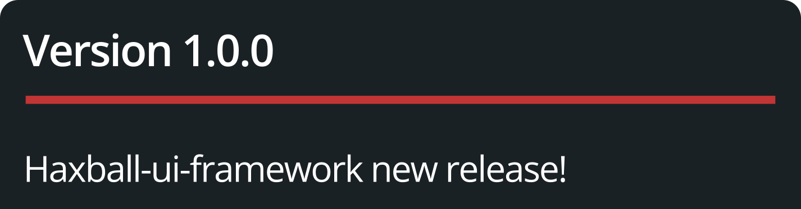

<p align="center">
  
</p>

# haxball-ui-framework

<p align="center">
  🇺🇸 English | <a href="README.es.md">🇪🇸 Español</a>
</p>

<p align="center">
<a href="LICENSE">
  
</a>
<a href="#architecture">
  
</a>
<a href="#project-structure">
  
</a>
<a href="#project-structure">
  
</a>
</p>

**HaxBall UI Framework is a minimal, stable UI layer for building overlay windows on top of the HaxBall client.**

It is not a full framework like React. It is not a game engine.
It is a **small, well-designed UI core** that gives you full DOM control without fighting HaxBall.

---

## 🧠 Core Idea

HaxBall UI Framework introduces a **thin overlay layer** over the HaxBall DOM that enables:

- window creation and management
- dynamic content updates
- clean lifecycle and destruction
- full CSS isolation via Shadow DOM
- safe event handling that doesn't leak into the game

Everything is built around a single principle:

> One API. One namespace. Full control.

---

## ⚙️ Architecture

The framework is divided into 4 layers:

| Layer | Responsibility |
| :--- | :--- |
| **RootMount** | Detects execution context, anchors `#haxui-root` to `document.body`, re-anchors if HaxBall clears the DOM |
| **Core** | `WindowManager`, `Window`, `EventGuard`, `StyleManager`, `EventRegistry` |
| **Public API** | `window.HaxUI` — the only global name exposed |
| **WindowHandle** | Lightweight object returned per window — no internals exposed |

---

## 📦 Project Structure

```txt
haxball-ui-framework/
│
├── core/
│   ├── HaxUI.js            # Public API entry point
│   ├── WindowManager.js    # Window registry and lifecycle
│   ├── Window.js           # Individual window with Shadow DOM
│   ├── RootMount.js        # Root node, context detection, re-anchor
│   ├── EventGuard.js       # Per-event-type policy for game isolation
│   ├── StyleManager.js     # Base styles injected into each Shadow Root
│   └── EventRegistry.js    # Listener registry for clean destroy()
│
├── constants/
│   └── config.js           # BASE_Z_INDEX, namespace, operation modes
│
├── utils/
│   └── sanitize.js         # DOMParser wrapper for safe setContent()
│
├── dev/
│   └── playground.js       # Manual tests and console examples
│
├── build.js                # Concatenates modules into a single IIFE bundle
├── package.json
└── haxball-ui.bundle.js    # Generated output — inject this into HaxBall
```

---

## 🚀 Getting Started

### 1. Clone the repository

```bash
git clone https://github.com/your-username/haxball-ui-framework
cd haxball-ui-framework
```

### 2. Build the bundle

No dependencies required. Just Node.js.

```bash
node build.js
# → haxball-ui.bundle.js
```

### 3. Inject into HaxBall

**Option A — DevTools console** (development):
Paste the contents of `haxball-ui.bundle.js` directly into the browser console while HaxBall is open.

**Option B — Tampermonkey** (recommended):
Create a userscript with `@require file:///absolute/path/to/haxball-ui.bundle.js` and enable local file access in Tampermonkey settings.

---

## 🧩 Public API

### Initialize

```js
// Optional — called automatically on first createWindow() if omitted
HaxUI.init({ baseZ: 9000 });
```

### Create a window

```js
const win = HaxUI.createWindow({
  id: 'stats',
  title: 'Statistics',
  width: 260,
  height: 180,
  x: 16,
  y: 16,
  content: '<p>Loading...</p>'
});
```

### Update content

```js
// Safe: pass a Node, not a raw string with external data
const node = document.createElement('div');
node.textContent = 'Goals: ' + data.goals;
win.setContent(node);

// Also valid for static markup
win.setContent('<p>Match ended</p>');
```

### Show / hide

```js
win.show();
win.hide();
```

### Destroy

```js
win.destroy();

// Or by ID
HaxUI.destroyWindow('stats');

// Or everything at once (use on script unload)
HaxUI.destroyAll();
```

### Get an existing window

```js
const existing = HaxUI.getWindow('stats');
if (existing) {
  existing.setContent('<p>Restarting...</p>');
}
// getWindow() returns null if not found — never throws
```

---

## 🔒 Design Decisions

Every decision responds to a specific HaxBall environment risk.

| Decision | Risk mitigated |
| :--- | :--- |
| Shadow DOM per window (with CSS namespace fallback) | HaxBall's global CSS bleeding into overlay elements |
| Single `window.HaxUI` namespace | Collisions with HaxBall's own globals or other scripts |
| `EventGuard` with per-event-type policy | Keyboard/mouse events leaking into the game |
| `BASE_Z = 9000`, configurable | Overlay windows rendering behind HaxBall's own menus |
| `MutationObserver` in `RootMount` | HaxBall clearing the DOM on room transitions |
| `DOMParser` in `setContent()` | XSS when rendering external strings (player names, chat) |
| `WindowHandle._destroyed` flag | Safe post-destroy calls — no errors inside game callbacks |
| Context detection in `RootMount.init()` | Script injected into the wrong frame (iframe environments) |

---

## 🎯 Example: Live Stats Overlay

```js
HaxUI.init();

const stats = HaxUI.createWindow({
  id: 'haxui-stats',
  title: 'Stats',
  width: 260,
  height: 180,
  x: 16,
  y: 16
});

function onGameData(data) {
  const node = document.createElement('div');
  node.innerHTML = [
    '<div>Team 1: ' + data.score[0] + '</div>',
    '<div>Team 2: ' + data.score[1] + '</div>',
    '<div>Possession: ' + data.possession + '%</div>',
    '<div>Time: ' + data.time + '</div>'
  ].join('');
  stats.setContent(node);
}

function onLeaveRoom() {
  HaxUI.destroyAll();
}
```

---

## 🗺️ Roadmap

- [x] **v0 — Core**
  - [x] Window creation and destruction
  - [x] Dynamic content updates
  - [x] Shadow DOM isolation with CSS fallback
  - [x] Event isolation from the game
  - [x] DOM re-anchor on HaxBall transitions
- [ ] **v1 — Interaction**
  - [ ] Drag & drop windows
  - [ ] Resize from edges
- [ ] **v2 — Components**
  - [ ] Component system for `setContent()`
  - [ ] Base components: text, table, list, button
- [ ] **v3 — Plugins**
  - [ ] `HaxUI.use(plugin)` plugin registration
  - [ ] Window lifecycle hooks for plugins
  - [ ] Cook a Cake

---

## ⚠️ Status

> **Project Status:** v0 — core architecture stable, APIs may still evolve.

---

## 🧠 Design Philosophy

- minimal surface area, maximum control
- one global name, zero internals exposed
- every decision traceable to a real HaxBall environment risk
- extensible to v1–v3 without breaking the v0 API contract

---

## 📄 License

MIT

---

<p align="center">
  ❤️ <a href=".gitignore">DEVLOG</a>
</p>

<p align="center">
  <br>
  <sub>made with love :)</sub>
</p>
